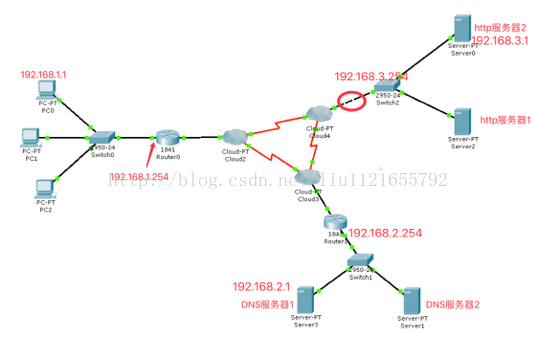

# 通过浏览器访问百度的详细过程？
1. 在浏览器输入网址按下回车后，浏览器会组织一个tcp格式的数据包。
2. 该数据需要获得对方的ip和端口（一般情况默认为80）
3. 为了获得www.baidu.com对应的ip地址，需要进行域名解析。首先，需要发送dns数据包给dns服务器，为了能够发送dns数据包，需要检查dns服务器ip和本机ip是否在同一网段，如果不在，那么会先将dns数据包发送给默认网关，若没有默认网关的mac，需要发送arp数据包获取默认网关的mac，然后将dns数据包发送给默认网关，接下来数据包将通过层层转发到达了dns服务器上的网关，这个网关把数据转发到DNS服务器，该服务器通过解析数据把域名所对应的ip返回到本机，这样就获取到了域名所对应的ip。
4. 接下来将tcp的数据转发给默认网关，默认网关将数据转发到目标服务器上的默认网关，默认网关将数据转发给目标服务器（注意此时收到的数据是tcp的3次握⼿手的第1次）。
5. 进行tcp三次握手，建立连接。
6. 浏览器发出HTTP请求，请求百度首页
7. 服务器通过HTTP响应把首页文件发送给浏览器。
8. 当所有的数据都接收完毕之后，就是4次挥手。
9. 浏览器将返回的信息进行渲染，显示baidu的主页。
 
## 相关问题
### URL的格式是什么样的？
url的格式一般为: 协议类型://<主机名>:<端口>/<路径>/文件名
### URL使用的scheme是HTTP，会有什么问题吗？
不安全
### 那有哪些安全风险？
http是超文本传输协议，信息是明文传输，可能导致信息被窃取。
### 改用HTTPS，那HTTPS是怎么规避安全风险的？
具有安全性的ssl加密传输协议（证书）

